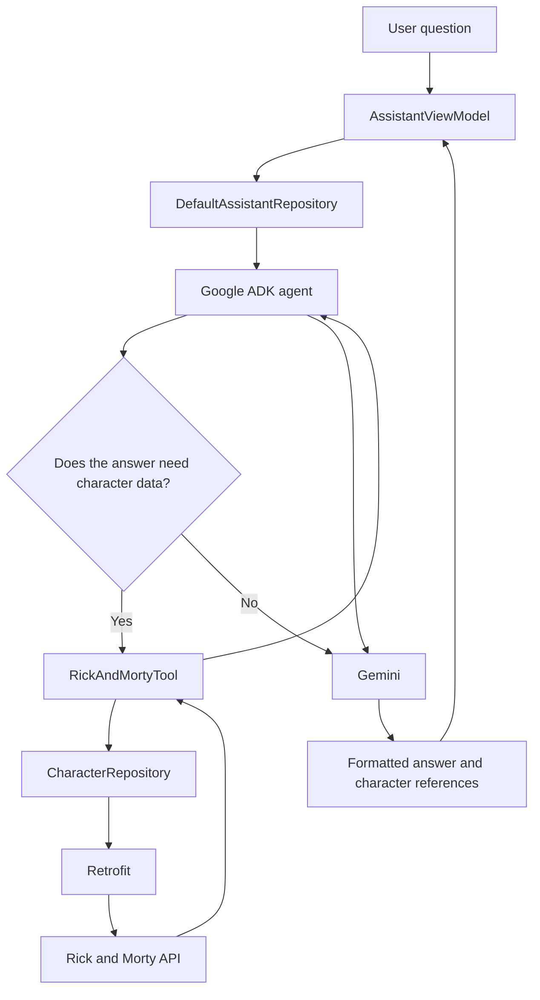

# Rick and Morty App

<p align="center">
  
</p>

An Android application for exploring characters from the
[Rick and Morty API](https://rickandmortyapi.com/), with infinite scrolling,
search and filters, plus an AI assistant powered by Gemini and Google's Agent
Development Kit (ADK).

## Features

### Character explorer

- Character list built with Jetpack Compose and Material 3.
- Character name, status, origin and image.
- Search by character name.
- Filter dialog with status and origin selectors.
- Infinite scrolling that loads the next API page when the user reaches the end.
- Separate initial-loading, loading-more, empty and error states.
- Retry support for both the first request and pagination failures.

### AI assistant

- Dedicated chat experience for questions about the Rick and Morty universe.
- A selectable assistant—Rick, Morty, Summer, Beth or Jerry—with matching
  avatar, welcome message and AI personality.
- A personalized floating action button that displays the active assistant and
  addresses the selected character by name, with previous and next controls.
- Gemini integration through Firebase AI Logic and Google ADK for Kotlin.
- ADK function tool that retrieves canonical character data from the Rick and
  Morty API before Gemini writes a factual answer.
- Referenced-character cards attached to assistant messages.
- Markdown rendering for bold and italic text, inline code, lists and links.
- Conversation state managed by an independent `AssistantViewModel`.
- Localized assistant copy in English and Spanish.

### Developer experience

- Custom adaptive app icon inspired by the portal gun.
- Chucker network inspection in debug builds, with its no-op artifact in release
  builds.
- Firebase App Check debug provider for development and Play Integrity for
  release.
- Deterministic unit tests for coroutine-based presentation and assistant logic.

## Architecture

The project uses MVVM with a layered structure that separates UI, domain and
data responsibilities:

```text
app/
├── data/
│   ├── assistant/     # ADK agent and RickAndMortyTool
│   ├── mapper/        # API DTO to domain transformations
│   ├── remote/        # Retrofit API, DTOs and network configuration
│   └── repository/    # Character and assistant repository implementations
├── domain/
│   ├── model/         # Character, CharacterPage and AssistantReply
│   └── repository/    # Repository contracts
├── di/                # Explicit dependency container
└── ui/
    ├── assistant/     # Chat UI, Markdown renderer and ViewModel
    ├── characters/    # Character list, search, filters and pagination
    ├── navigation/    # Compose navigation graph
    └── theme/         # Material theme and colors
```

Dependencies are created in an application-level container and passed to the
ViewModels through custom factories. This keeps presentation logic independent
from networking and AI implementations without introducing a dependency
injection framework for the current project scope.

### Assistant data flow



For factual character questions, the agent calls `search_characters`. The tool
accepts an optional name, status and page, delegates the request to the same
character repository used by the app, and returns structured results to Gemini.
The assistant then writes the final response in the user's language.

## Tech stack

| Area | Technology |
| --- | --- |
| Language | Kotlin |
| UI | Jetpack Compose, Material 3 |
| Architecture | MVVM, layered data/domain/UI structure |
| State and concurrency | StateFlow, Kotlin Coroutines |
| Navigation | Navigation Compose |
| Networking | Retrofit, OkHttp, Gson |
| Images | Coil |
| AI | Firebase AI Logic, Gemini, Google ADK for Kotlin |
| App attestation | Firebase App Check |
| Debug networking | Chucker |
| Testing | JUnit 4, kotlinx-coroutines-test |

## Requirements

- Android Studio with JDK 11 support.
- Android SDK 37.
- A device or emulator running Android 8.0 (API 26) or newer.
- A Firebase project configured for the Android application ID
  `com.erickjuarez.rickandmorty`.

## Firebase setup

The Rick and Morty character browser uses the public REST API without an API
key. The AI assistant requires Firebase configuration:

1. Create or select a Firebase project.
2. Register an Android app with package name
   `com.erickjuarez.rickandmorty`.
3. Download `google-services.json` and place it in the `app/` directory.
4. Enable Firebase AI Logic and configure access to the Gemini model.
5. Enable Firebase App Check:
   - Debug builds use the App Check debug provider. Register the debug token
     printed by the app in Logcat in the Firebase console.
   - Release builds use the Play Integrity provider and require the matching
     Play/Firebase configuration.

`google-services.json` is intentionally excluded from version control.

## Run the app

1. Clone the repository:

   ```bash
   git clone https://github.com/ErickDaniel/RickAndMortyApp.git
   cd RickAndMortyApp
   ```

2. Complete the Firebase setup described above.
3. Open the project in Android Studio and sync Gradle.
4. Select an emulator or physical device and run the `app` configuration.

To build a debug APK from the terminal:

```bash
sh gradlew assembleDebug
```

## Network inspection

Debug builds include [Chucker](https://github.com/ChuckerTeam/chucker). While
using the app, Chucker exposes the Rick and Morty API requests through its
notification and inspection screen. Release builds use Chucker's no-op artifact,
so network inspection code is disabled outside debug builds.

## Testing

The project currently includes 22 JVM unit tests covering:

- `AssistantViewModel` initial state, input updates, successful responses,
  referenced characters, concurrent-send prevention and localized errors.
- `RickAndMortyTool` declaration, argument normalization, successful API data,
  empty 404 results and unexpected failures.
- Assistant persona definitions, canonical avatars, circular selection and the
  distinct ADK personality prompts with shared grounding rules.
- Conversion of ADK tool responses into character references.
- Markdown parsing for emphasis, inline code, lists, links and unsafe or
  incomplete markup.

The tests use fake repositories and controlled coroutine dispatchers. They do
not consume Gemini quota and do not perform real network requests.

Run all local unit tests with:

```bash
sh gradlew test
```

Build and test both application variants with:

```bash
sh gradlew test assembleDebug assembleRelease
```

## Technical decisions

### Unidirectional UI state

Each screen observes a single immutable state exposed by its ViewModel. Compose
renders loading, content, empty and error states without owning data-access or
business logic.

### Shared character repository

Both the character browser and the ADK tool depend on
`ICharacterRepository`. This keeps Retrofit details out of the UI and ensures
the assistant obtains character facts through the same data boundary as the
rest of the application.

### Separate data and domain models

Retrofit response DTOs are converted into small domain models before they reach
the ViewModels. The UI therefore remains independent of the external API's JSON
shape.

### AI grounded with a function tool

Gemini does not need to rely only on model memory for character facts. ADK can
invoke `RickAndMortyTool`, which queries the REST API and returns structured
character data. Those results are also collected as references so the chat can
show the relevant character cards with the answer.

### Build-specific diagnostics and attestation

Debug and release variants use different implementations where appropriate:
Chucker is fully enabled only in debug, while App Check uses the debug provider
during development and Play Integrity in release.

## Future improvements

- Pull to refresh for the character list.
- Offline caching with Room.
- Dependency injection with Hilt or Koin as the project grows.
- Compose UI and navigation tests.
- Additional unit coverage for character-list filtering and pagination.
- Crash reporting and production observability.
- Broader assistant tools for locations and episodes.

## AI-assisted development

AI tools were used as a development aid throughout the project for exploring
architecture options, reviewing code, troubleshooting, generating visual
concepts, identifying test cases and improving documentation. Suggestions were
reviewed and adapted incrementally; implementation decisions and final
validation remained part of the development process.

## Data source

Character information and images are provided by the public
[Rick and Morty API](https://rickandmortyapi.com/documentation).
